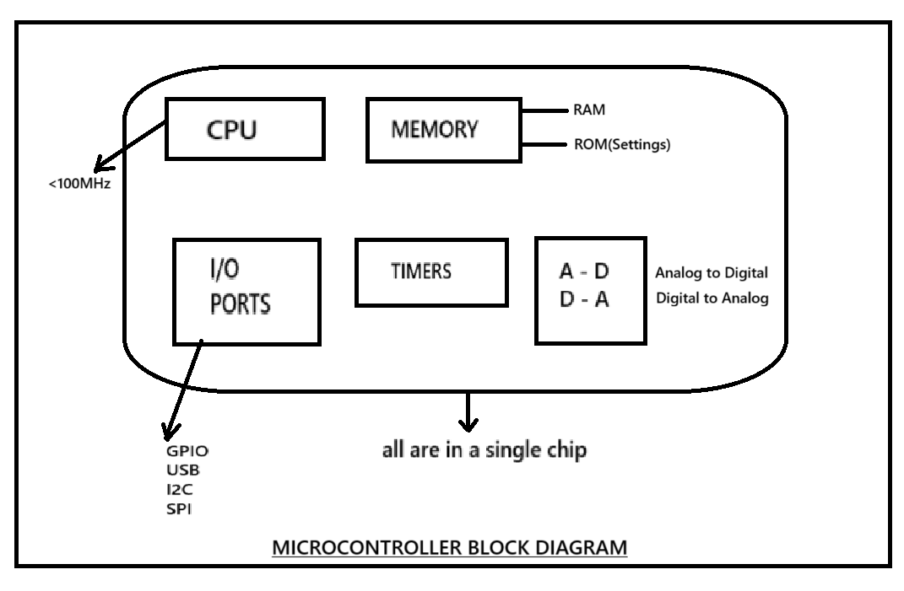
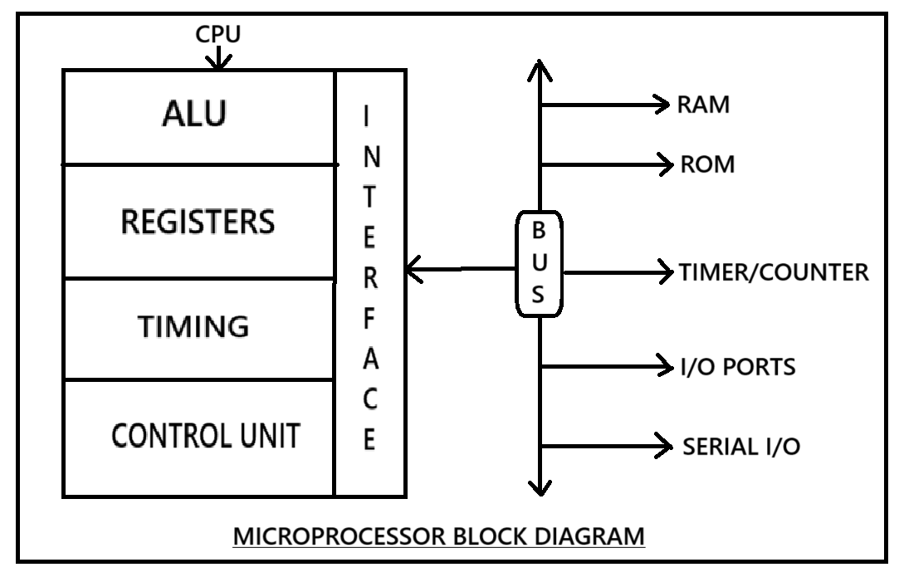
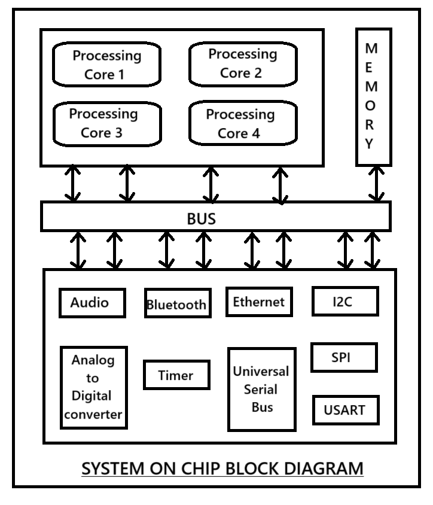
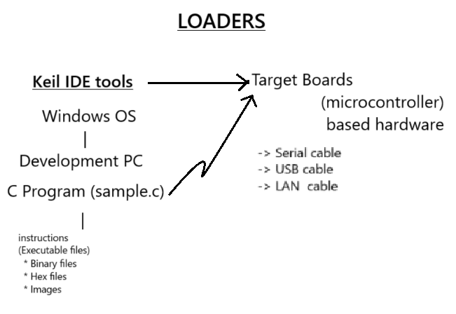

# 📝 Week 1 – Introduction to Embedded Systems

## 🔧 What is an Embedded System?
An embedded system is a computer system designed to perform a specific task.

## 💡 Key Features
- Application-specific
- Real-time operation
- Power efficient

## 🆚 Microcontroller vs Microprocessor

### Microcontroller 
* Single core 
* Speed:
  1) 8051 -> 12MHz(cycles/sec)
   * microcontroller speed is measured in Hz (cycles/sec)
   * 8051 is designed by intel in 1980
   * Advanced versions of 8051 are 22MHz to 80MHz
  2) Arduino is a hardware and software platform
   * ATmega2560 microcontroller is used in Arduino
   * ATmega2560 microcontroller is developed by Atmel (now Microchip) in 1998
   * Atmega2560 microcontroller speed is 16MHz (cycles/sec)
  3) ARM7 -> 12MHz
   * Advanced versions runs at 88MHz
   * Developed by ARM (Advanced RISC Machines) Holdings in 1990
   * Most of the microcontrollers runs below 100MHz
* Memory:
  * Memory required for a microcontroller is very less (i.e., KB's to MB's)
* OS:
  * No OS is required for a microcontroller
* Microcontrollers in short can also be called as MCU (Microcontroller Unit)
*  #### Note: We can't run  a full-fledged OS on a microcontroller based device
### Microprocessor
* Multi core
* Speed:
  1) Intel i3,i5,i7,i9 
     * Above 1GHz to 5GHz (1GHz = 1024MHz)
  2) Intel SBC's(Single Board Computers) used in defence, aerospace, medical technology
* Memory:
  * Memory required for a microprocessor is from MB's to GB's
* OS:
  * Windows/ Linux/ Mac
* Hardware components like memory, I/O controllers and timers e.t.c. are connected through physical lines called as BUSES

## 🆚 Microcontroller vs Microprocessor

| Feature              | Microcontroller (MCU)                                                                 | Microprocessor (MPU)                                                                 |
|----------------------|----------------------------------------------------------------------------------------|---------------------------------------------------------------------------------------|
| **Core**             | Single-core                                                                            | Multi-core                                                                            |
| **Speed**            | - 8051: 12 MHz (Intel, 1980)    - ATmega2560 (Arduino): 16 MHz (Atmel, 1998)    - ARM7: 12 MHz to 88 MHz | - Intel i3/i5/i7/i9: 1 GHz to 5 GHz    - Intel SBCs for defence, aerospace, etc.   |
| **Memory**           | Very low – **KBs to MBs**                                                              | High – **MBs to GBs**                                                                 |
| **Operating System** | Not required – runs on firmware                                                        | Required – supports full OS like **Windows / Linux / macOS**                         |
| **Usage**            | Embedded systems, real-time control, small devices                                     | General computing, high-end processing, multitasking                                 |
| **Components**       | Includes CPU, memory, and I/O in a single chip                                         | CPU is separate; other components connected externally via **buses**                 |
| **Examples**         | 8051, ATmega2560 (Arduino), ARM7                                                       | Intel i-Series, AMD Ryzen, Intel SBCs                                                |
| **Key Point**        | Cannot run full-fledged OS                                                             | Can run modern operating systems                                                     |
| **Alternate Name**   | **MCU (Microcontroller Unit)**                                                         | **MPU (Microprocessor Unit)**                                                        |

## Microcontroller Block Diagram

## Microprocessor Block Diagram

* SOC's are designed by combining some of best features of both microcontrollers and microprocessors.
## Block diagram of SOC

## Microcontroller
* Arduino IDE
* Keil IDE
* Windows GUI IDE
* All tools needed for embedded software development are integrated into a single software package called as IDE (Integrated Development Environment)
  
## Microprocessor
* Windows
* Linux
* Mac
  
## SOC
* Full Fledged OS
  * Embedded Linux (or) Varients of Linux
  * ex. 
    * Android -> Linux
    * Smart TV -> Samsung - Tizen (Linux)
                * LG - webOS (Linux)
                * Sony - Android (Linux)
                * Router - OpenWRT (Linux)
  
  
### Tools used in Embedded Software Development are 
  * Text Editor
  * Compiler
  * Debugger
  * Loaders/Linkers

## Development Tools
1) Write:
   * C programs are written using a text editor.
2) Compilation:
   * C statements to instructions.
   * Hardware capable of processing and executing instructions only.
   * C statements -> Assembly code -> Instructions
   * High level language -> Low level language
   * Human readable -> Machine readable
* Instructions:
   opcodes           |  operands
  ------------------- |-------------------
   operational code  | address of memory location in the RAM
  * opcode is a unique code that specifies the operation
  * operands can be address of memory location in the RAM or direct value or CPU register names

### Basic units of memory
Bits   |  Bytes
------|------
Each bit  | 0 or 1
8 bits  | 1 byte
16 bits | 2 bytes
32 bits | 4 bytes
64 bits | 8 bytes

## RAM
* Random Access Memory
* RAM is divided into bytes
* Every byte is identified by a unique address
* Addresses are always represent in hexadecimal format
  
## Errors
* Errors are of two types:
  * Compile time errors
  * Run time errors
* To find and resolve compile time errors, we use a compiler
* To find the run time errors, we use a debugger

## Loaders
